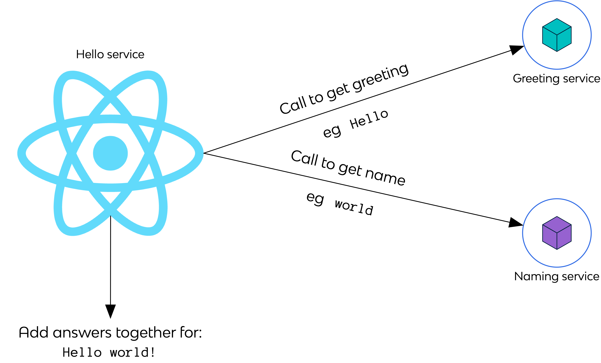

# React (JavaScript) website

Proof-of-Concept (PoC) application that calls 2 other services.

For example for "_Hello world!_" this app would be the one providing calling 2 services to get "_Hello_" and "_world_", and it would add the "_!_" at the end.



## Commands

Dependencies are defined in `package.json` and `package-lock.json`. To install the dependencies:

```console
npm ci
```

To build the application:

```console
npm build
```

To run the application:

```console
npm start
```

> Some Node.js-specific workarounds have to happen in the Dockerfile: adding `node_modules` to the path and installing `react-scripts`!

```console
docker run --interactive --tty --rm \
  --publish 3000:3000 \
  YOUR_IMAGE_ID_HERE
```
